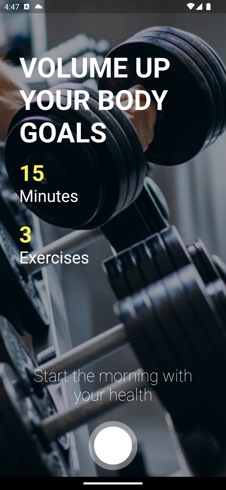
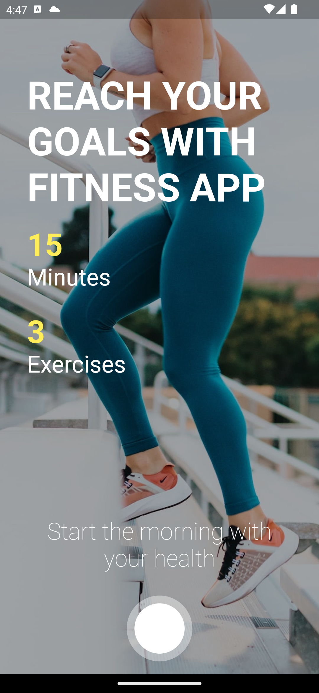
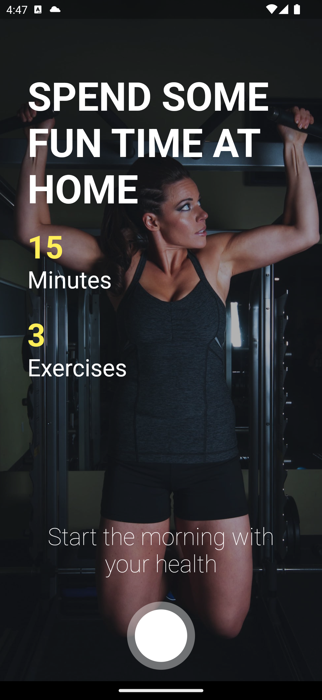
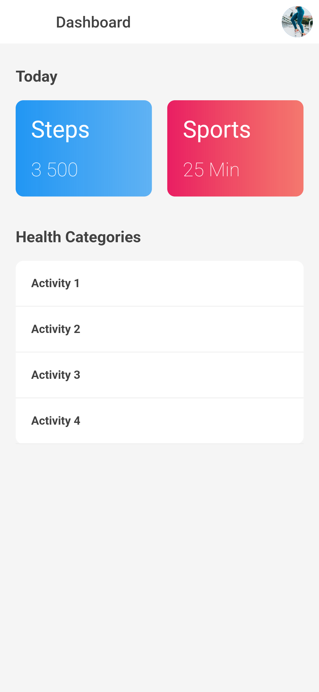

## Flutter 5/100 Days UI Concept : Training App

```dart
class Day5 extends Flutter100DaysOfCode {
  video() {
    return {
      "title": "Flutter Fitness App - Design Concept",
      "description": "Let's see how PageTransition animation works in flutter.",
      "day": 5,
      "videoLink": "#"
    }
  }
}
```

<br>

## Previous Designs

[Checkout my previous UI Concept](https://www.linkedin.com/feed/update/urn:li:activity:7031894946345361408/)
<br>

## Development Setup

Clone the repository and run the following commands:

```
flutter pub get
flutter run
```

## ScreenShot

&nbsp;&nbsp;&nbsp;&nbsp;&nbsp;&nbsp;&nbsp;&nbsp;&nbsp;

## Links

* [LinkedIn](https://www.linkedin.com/in/patrick-wilfried-kamelan-2b388a115/)
* [Twitter](https://twitter.com/KamelanPatrick)
* [Instagram](https://www.instagram.com/patrickispoppin/)
